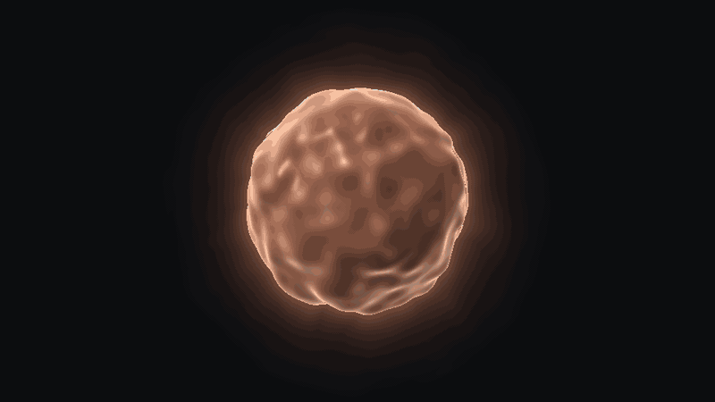

<p align="center"></p>

# Bubo

**A native Mac companion for Claude Code. Talk to it, run agents in parallel, watch them work.**

- **An orb you can talk to.** Hold the shortcut and speak. Bubo transcribes on your Mac, answers out loud, and its Metal orb turns into a shape that fits what you asked: a magnifying glass for a search, a cloud for the weather, a heart for health.
- **Sessions in parallel, each in its own git worktree.** Review the diff hunk by hunk, merge, and open the pull request without leaving the app.
- **A Galaxy of your project.** Folders are clusters, files are stars, and you can see which files your sessions read and write while they work.

The orb's color tells you who is answering. A router sends each question to the model that fits it: Claude, Apple's on-device model, or any OpenAI-compatible endpoint you connect (OpenRouter, Ollama, LM Studio).

**Download:** coming soon. Signed and notarized builds will appear on the [Releases](https://github.com/mgiuditta/bubo/releases) page. Until then, build from source (below).

Free and open source under the MIT license. Not affiliated with Anthropic.

## Requirements

- macOS 26 Tahoe on an Apple Silicon Mac
- The [Claude Code CLI](https://docs.anthropic.com/en/docs/claude-code), version 2.1.275 or later, installed and logged in

## How Bubo talks to Claude

Bubo runs the official `claude` binary, unmodified, with the login you already made yourself (`claude auth login`). It never reads, copies or stores your tokens, and it reads the account state only from `claude auth status`. If you prefer, you can add an Anthropic API key instead: Bubo keeps it in the Keychain and passes it only to the `claude` process it starts. When you reach a usage limit, Bubo asks what to do; it never switches to the API key, which is billed per use, on its own. The full reasoning is in [ADR 0003](docs/adr/0003-login-con-la-cli-claude-dell-utente.md) (in Italian).

## Build from source

You need Xcode 26, [XcodeGen](https://github.com/yonaskolb/XcodeGen) and [Bun](https://bun.sh) (the build compiles the small Agent SDK bridge in `bridge/` with it).

```sh
brew install xcodegen oven-sh/bun/bun
git clone https://github.com/mgiuditta/bubo.git
cd bubo
xcodegen generate
open Bubo.xcodeproj
```

The Xcode project is generated from `project.yml` and is not checked in; run `xcodegen generate` again after pulling changes. In Xcode, pick your own team under Signing & Capabilities, then run the Bubo scheme. `scripts/check.sh` runs the full check the project uses before every merge: build, tests, polish checks and a Release build.

## Built by Claude agents

Most of Bubo was written by Claude agents working in parallel, each in its own git worktree, on issues I wrote and put in order.

From the first commit on 29 September 2026 to 2 October 2026:

| | |
|---|---|
| Commits on `main` | 444, of which 262 are not merges and 255 of those have Claude as co-author |
| Merged pull requests | 160 |
| Closed issues | 242 |
| Swift | about 82,000 lines in 792 files |
| Tests | about 1,630 Swift Testing tests in 199 files |
| Architecture decisions | 10 ADRs |

My part: the brief, the product decisions, the order of the work, review and merge. The agents' part: most of the code, the tests, and much of the research behind each feature spec.

The whole history is public. Start from [`CONTEXT.md`](CONTEXT.md), the glossary every agent reads, then [`docs/adr/`](docs/adr/) and the merged pull requests. Some internal docs are in Italian, which is how the project started. The app is available in English and Italian.

## Regenerating the demo

The GIF above is not a screen recording. [`docs/media/orb-demo/render.sh`](docs/media/orb-demo/render.sh) compiles the app's own Metal shaders (`Bubo/Orb/`) and motion code, renders the orb off screen frame by frame, and encodes the GIF with ffmpeg. It needs Xcode and ffmpeg, and no window or screen recording permission.

```sh
docs/media/orb-demo/render.sh
```

The sequence of states, colors and shapes is in [`docs/media/orb-demo/main.swift`](docs/media/orb-demo/main.swift).

## Contributing

Bug reports and ideas are welcome as [GitHub issues](https://github.com/mgiuditta/bubo/issues). Before a pull request, read [`CONTEXT.md`](CONTEXT.md) for the project's vocabulary and [`CLAUDE.md`](CLAUDE.md) for the rules the agents follow, and run `scripts/check.sh`. If you work with Claude Code, it will pick up the same rules and skills from the repo.

## License

[MIT](LICENSE)
